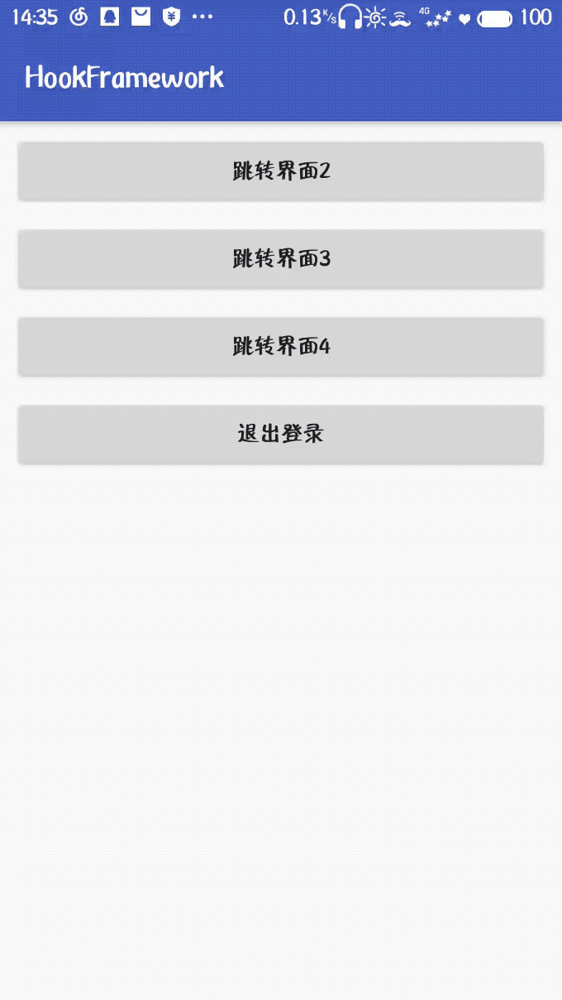
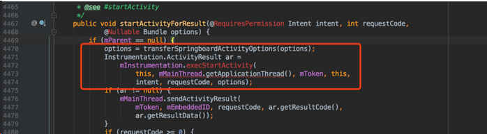
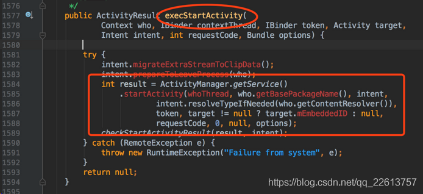
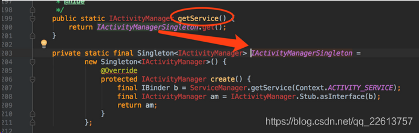
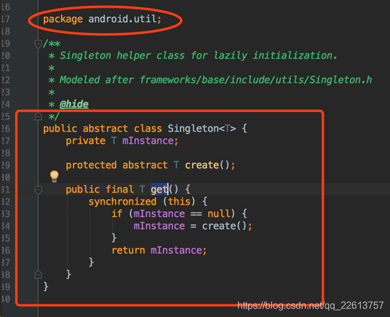
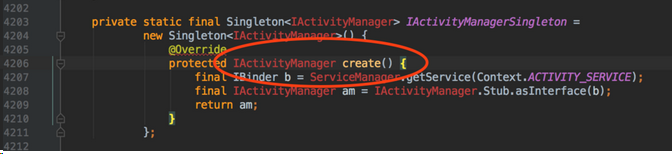
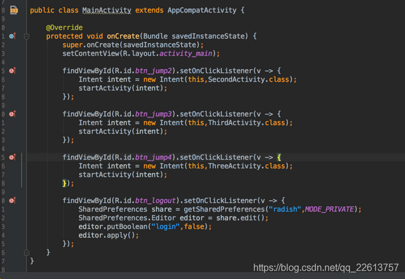
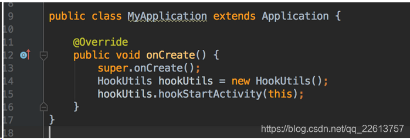
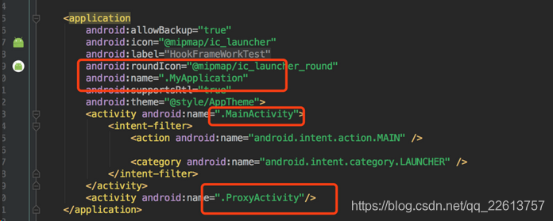
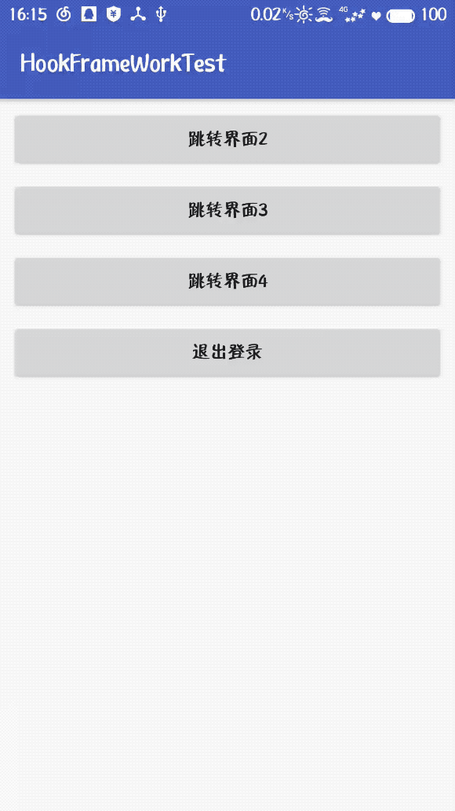

## Hook简介
微软的MSDN中，对Hook的解释为：
A hook is a point in the system message-handling mechanism where an application can install a subroutine to monitor the message traffic in the system and process certain types of messages before they reach the target window procedure.

微软只是简单的将`Hook`解释为一种过滤（或叫挂钩）消息的技术。  
我们这里讲解的`Hook`，简单解释为：挂钩，挂钩一切事物。包含微软的解释。  
挂钩的事物通常指的是函数。

**Hook 目的：**   
过滤一些关键函数调用，在函数执行前，先执行自己的挂钩函数。达到监控函数调用，改变函数功能的目的。

## 移动端的hook技术应用
可能前面讲的不是很透彻，通过后面的实例应该会更清晰。

### 1. what is Hook 技术（移动端）
> Hook技术又叫做钩子函数，在系统没有调用该函数之前，钩子程序就先捕获该消息，钩子函数先得到控制权，这时钩子函数既可以加工处理（改变）该函数的执行行为，还可以强制结束消息的传递。简单的来说，就是把系统的程序拉出来变成我们自己执行代码片段。

要实现钩子函数，有两个步骤：
- 利用系统内部提供的接口，通过实现该接口，然后注入进系统(特定场景下使用)
- 动态代理（使用所有场景）。

### 2.Hook技术实现的步骤
Hook 技术实现的步骤分两步：

- 找到`hook`点（`Java`层），该hook点必须满足以下的条件：需要`hook`的方法，所属的对象必须是静态的，因为我们要通过反射来获取对象，我们获取的是系统的对象，不能够new一个对象，必须用系统创建的那个对象，所以只有静态的才能保证和系统的对象一致。
- 将`hook`方法放到系统之外执行（放入我们自己的逻辑）

### 3.在移动开发中的应用：
**使用 hook 技术实现免注册式跳转**



- 上面的图，有一个`MainActivity`，四个按钮，前三个是打开不同的`Activity`，最后一个是退出登录，这三个`Activity`其中界面2是不需要登陆的，界面3和界面4都是需要登录才能看到。  

- 既然要在打开`Activity`之前就判断是否登录，要使用hook技术，接下看分析一下源码，`hook`就是`startActivity`的方法。


**找Hook点**






> 看到这，我们明白了，其实是 `ActivityManager.getService()` 最终调用了 `startActivity()` 方法，我们看 `ActivityManager.getService()` 方法。







> 解释一下上面的源码，`ActivityManager.getService()`方法调用的是 `IActivityManagerSingleton.get()`方法，而这个`IActivityManagerSingleton`是 `Singleton(android.util)`，所以 `IActivityManagerSingleton.get()`就是调用了 `Singleton` 里面的 `get` 方法，进到 `Singleton` 类，发现 `get()` 方法里面会通过 `create()` 抽象方法方法给 `mInstance` 属性赋值，回到刚才的地方，我们发现，`create()` 方法返回了一个 `IAcivityManager` 对象。最终结果：其实最终是 `IActivityManager` 调用了 `startActivity()` 方法。

> 所以我们真正想 `hook` 的点是 `IActivityManager` 对象，那么如何拿到这个静态对象呢？其实聪明的帅哥和美女肯定都发现了，这个 `IActivityManagerSingleton` 其实就是一个静态的，而且我们拿到该系统对象后就获取到该对象的 `mInstance` 属性，即 `IActivityManager`，那么我们就把 `IActivityManagerSingleton` 当做一个伪 `hook` 点。

> `hook` 点已经找到了，第一步已经完成，接下来就该第二步了，那么如何将系统执行的 `startActivity()` 拉到系统外执行，给其添加一些自己的逻辑呢？这里我们使用动态代理来实现。

> 这里大概说一下项目，肯定有五个 `Activity`，一个 `MainActivity` 是用来展示四个按钮的，一个 `LoginActivity`，还有其他三个是测试的展示页面，其实还有一个 `ProxyActivity`，并且，在清单文件中，我们除了 `MainActivity` 是启动页，`ProxyActivity` 进行了注册，其他的 `Activity` 都没有在清单文件中注册，没错，你没有看错，就是没有注册，那运行会崩溃吗？空口无凭，我们先看一下代码，然后看运行结果。

```java
package com.radish.android.hookframeworktest;

import android.content.Context;
import android.content.Intent;

import java.lang.reflect.Field;
import java.lang.reflect.InvocationHandler;
import java.lang.reflect.Method;
import java.lang.reflect.Proxy;

public class HookUtils {

    private Context context;

    public void hookStartActivity(Context context) {
        this.context = context;
        try {
            /**
             * 这里注意一下，用我们分析的源码运行不了，所以稍微改了一下，
             * 思路什么都一样，只是源码的属性名做了修改
             */
//            Class<?> activityManagerClass = Class.forName("android.app.ActivityManager");
            Class<?> activityManagerClass = Class.forName("android.app.ActivityManagerNative");
            //拿到 IActivityManagerSingleton 属性
//            Field field = activityManagerClass.getDeclaredField("IActivityManagerSingleton");
            Field field = activityManagerClass.getDeclaredField("gDefault");
            field.setAccessible(true);
            //获取到是 Singleton 对象，也就是 field 对应的类型
            Object singletonObj = field.get(null);

            //然后获取 Singletone 的 mInstance 属性
            Class<?> singtonClass = Class.forName("android.util.Singleton");
            Field mInstanceField = singtonClass.getDeclaredField("mInstance");
            mInstanceField.setAccessible(true);
            //真正的 hook 点
            Object iActivityManagerObj = mInstanceField.get(singletonObj);

            //hook 第二步，动态代理
            Class<?> iActivityManagerIntercept = Class.forName("android.app.IActivityManager");
            StartActivityHandler startActivityHandler = new StartActivityHandler(iActivityManagerObj);
            Object proxyIActivityManager = Proxy.newProxyInstance(getClass().getClassLoader(),
                    new Class[]{iActivityManagerIntercept}, startActivityHandler);
            //在这我们将系统的对象更换成我们生成的动态代理对象，为了是调用动态代理的 invoke 方法，不更换不执行
            mInstanceField.set(singletonObj, proxyIActivityManager);
        } catch (Exception e) {
            e.printStackTrace();
        }
    }

    class StartActivityHandler implements InvocationHandler {

        //系统真正的对象
        private Object trueIActivityManager;

        public StartActivityHandler(Object trueIActivityManager) {
            this.trueIActivityManager = trueIActivityManager;
        }

        @Override
        public Object invoke(Object proxy, Method method, Object[] args) throws Throwable {
            if ("startActivity".equals(method.getName())) {
                System.out.println("abc : --------------------- startActivity ---------------------");
                Intent intent = null;
                int index = -1;
                for (int i = 0; i < args.length; i++) {
                    Object obj = args[i];
                    if (obj instanceof Intent) {
                        //找到 startActivity 传递进来的 Intent
                        intent = (Intent) obj;
                        index = i;
                    }
                }
                //瞒天过海，获取想要跳转的意图，进行篡改
                Intent newIntent = new Intent(context, ProxyActivity.class);
                //我们将真实的意图封装在假意图当中
                newIntent.putExtra("oldIntent", intent);
                args[index] = newIntent;
            }
            return method.invoke(trueIActivityManager, args);
        }
    }
}
```



接下来是使用：







> 总结下，目前我们实现的功能是，不管你跳转任何的 `Activity`，我们都跳转到 `ProxyActivity`，所以我们只需要在清单文件中注册一个 `ProxyActivity` 而不用注册其他的 `Activity` 也不会崩溃，是如何实现的呢？我们是通过使用 hook 技术篡改 `Intent`，并将你真正的意图存放到我们新的 `Intent` 中。这时候，应该有些人要打我了，我明明想去东京和巴黎，你却带我去了浪漫的土耳其~~~~~

## Windows端应用

### 1. what is hook(钩子)

- 对于`Windows`系统，它是建立在事件驱动机制上，简单的将就是整个系统都是通过消息传递实现的。`hook`（钩子）是一种特殊的消息处理机制，他可以监视系统或者进程中的各种事件信息，截获发往目标窗口的消息并进行处理。所以说，我们可以在系统中自定义钩子，用来监视系统中特定事件的发生，完成特定功能，如屏幕取词，监视日志，截获键盘，鼠标输入等。

- 钩子的种类很多，每种钩子可以截获相应的消息，如键盘钩子可以截获键盘消息，外壳钩子可以截取、启动和关闭应用程序的消息等。钩子可以分为线程钩子和系统钩子，线程钩子可以监视指定线程的事件消息，系统钩子监视系统中的所有线程的事件消息。因为系统钩子会影响系统中所有的应用程序，所以钩子函数必须放在独立的动态链接库(`DLL`) 中。
所以说，`hook`（钩子）就是一个`Windows`消息的拦截机制，可以拦截单个进程的消息(线程钩子)，也可以拦截所有进程的消息(系统钩子)，也可以对拦截的消息进行自定义的处理。`Windows`消息带了一些程序有用的信息，比如`Mouse`类信息，就带有鼠标所在窗体句柄、鼠标位置等信息，拦截了这些消息，就可以做出例如金山词霸一类的屏幕取词功能。

### 2. Hook分类

1. 线程钩子监视指定线程的事件消息。

2. 系统钩子监视系统中的所有线程的事件消息。因为系统钩子会影响系统中所有的应用程序，所以钩子函数必须放在独立的动态链接库(DLL)中。这是系统钩子和线程钩子很大的不同之处。


### 3. Hook工作原理

- 在正确使用钩子函数前，我们先讲解钩子函数的工作原理。当您创建一个钩子时，`WINDOWS`会先在内存中创建一个数据结构，该数据结构包含了钩子的相关信息，然后把该结构体加到已经存在的钩子链表中去。新的钩子将加到老的前面。当一个事件发生时，如果您安装的是一个线程钩子，您进程中的钩子函数将被调用。如果是一个系统钩子，系统就必须把钩子函数插入到其它进程的地址空间，要做到这一点要求钩子函数必须在一个动态链接库中，所以如果您想要使用系统钩子，就必须把该钩子函数放到动态链接库中去。

- 当然有两个例外：工作日志钩子和工作日志回放钩子。这两个钩子的钩子函数必须在安装钩子的线程中。原因是：这两个钩子是用来监控比较底层的硬件事件的，既然是记录和回放，所有的事件就当然都是有先后次序的。所以如果把回调函数放在`DLL`中，输入的事件被放在几个线程中记录，所以我们无法保证得到正确的次序。故解决的办法是：把钩子函数放到单个的线程中，譬如安装钩子的线程。


**几点需要说明的地方：**

（1） 如果对于同一事件（如鼠标消息）既安装了线程钩子又安装了系统钩子，那么系统会自动先调用线程钩子，然后调用系统钩子。

（2） 对同一事件消息可安装多个钩子处理过程，这些钩子处理过程形成了钩子链。当前钩子处理结束后应把钩子信息传递给下一个钩子函数。而且最近安装的钩子放在链的开始，而最早安装的钩子放在最后，也就是后加入的先获得控制权。

（3） 钩子特别是系统钩子会消耗消息处理时间，降低系统性能。只有在必要的时候才安装钩子，在使用完毕后要及时卸载。
